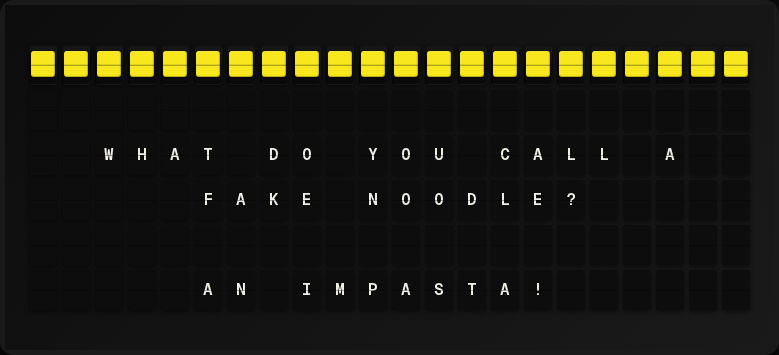

# Dad Jokes Plugin

Display random dad jokes from the [icanhazdadjoke](https://icanhazdadjoke.com/) API.

**→ [Setup Guide](./docs/SETUP.md)** - Configuration instructions

## Overview

The Dad Jokes plugin fetches random dad jokes from the icanhazdadjoke API and displays them on your board.



## Template Variables

```
{{dad_jokes.joke}}    # The joke text
```

## Example Templates

### Centered Joke (Recommended)

Use the `|wrap` filter to automatically word-wrap jokes across multiple lines:

```
{center}{{dad_jokes.joke|wrap}}
```

This displays as:
```
 Why did the scarecrow
  win an award? Because
   he was outstanding
    in his field!
```

**Tip:** The `|wrap` filter fills empty lines below it, and `{center}` centers each line.

### Left-Aligned

```
{{dad_jokes.joke|wrap}}
```

## Configuration

| Setting | Type | Default | Description |
|---------|------|---------|-------------|
| enabled | boolean | false | Enable/disable the plugin |

## API

This plugin uses the free [icanhazdadjoke API](https://icanhazdadjoke.com/api). No API key is required.

## Author

FiestaBoard Team
